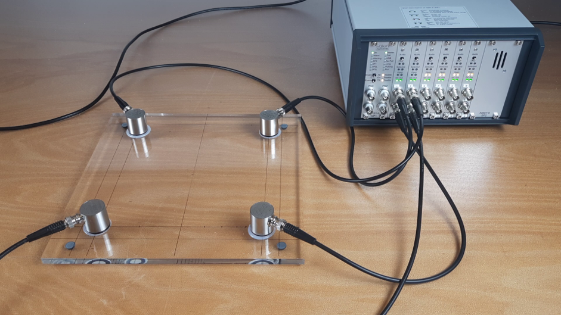

# PMMA plate with different AE sources

This dataset consists of AE signals generated by different sources on a PMMA plate.
It is intended for studying and experimenting with data-based approaches for AE source classification.

The PMMA plate is excited using three distinct AE sources:

1. Pencil lead breaks
2. Salt trickle
3. Pulsing by the measurement system

[YouTube Video](https://www.youtube.com/watch?v=_dbjC0yPxEM)

## Structure

- Material: Polymethyl methacrylate (PMMA)
- Dimensions: 300 x 300 x 9.7 mm

## Measurement chain

- Vallen AMSY-6 AE measurement system with ASIP-2A signal processor cards
- 4x [Vallen VS150-RSC](https://www.vallen.de/sensors/integrated-preamplifier-sensors/vs150-rsc-2/) sensors with 34 dB preamplifier gain
- Measurement settings:
  - Filter: 95-300 kHz
  - Threshold: 40 dBAE
  - Duration discrimination time: 1000 µs
  - TR (transient/raw data):
    - Samplerate: 2500 kHz
    - Pretrigger samples: 100
    - Post-duration samples: 1000

### Sensor positions

The sensors are arranged in a square configuration on the PMMA plate:

| Channel | X [mm] | Y [mm] |
| ------- | ------ | ------ |
| 1       | 50     | 50     |
| 2       | 250    | 50     |
| 3       | 50     | 250    |
| 4       | 250    | 250    |

## Files

All files can be downloaded here: https://filetransfer.vallen.de/openae/datasets/pmma-plate-sources/.

Each measurement consists of two SQLite3 database files:

- `*.pridb`: The primary database, that stores just the AE features (amplitude, energy, counts, duration, rise time, ...) and the index of the transient/raw data `TRAI`. Use the table `view_ae_data`.
- `*.tradb`: The transient database, that stores the raw data for each hit record referenced by the `TRAI` index. Use the table `view_tr_data`. The raw data is stored in the `Data` column in binary format (`int16` values). The factor from column `TR_mV` can be used to transform the integer values to millivolts.

You may want to use the Python library [vallenae](https://github.com/vallen-systems/vallenae) to easily read the measurement files.

| Link                            | Source             | Hits |
| ------------------------------- | ------------------ | ---- |
| [plbs.pridb] [plbs.tradb]   | Pencil leak breaks | 266  |
| [salt.pridb] [salt.tradb]   | Salt trickle       | 282  |
| [pulse.pridb] [pulse.tradb] | Pulsing            | 292  |

[plbs.pridb]: https://filetransfer.vallen.de/openae/datasets/pmma-plate-sources/plbs.pridb
[plbs.tradb]: https://filetransfer.vallen.de/openae/datasets/pmma-plate-sources/plbs.tradb
[salt.pridb]: https://filetransfer.vallen.de/openae/datasets/pmma-plate-sources/salt.pridb
[salt.tradb]: https://filetransfer.vallen.de/openae/datasets/pmma-plate-sources/salt.tradb
[pulse.pridb]: https://filetransfer.vallen.de/openae/datasets/pmma-plate-sources/pulse.pridb
[pulse.tradb]: https://filetransfer.vallen.de/openae/datasets/pmma-plate-sources/pulse.tradb
